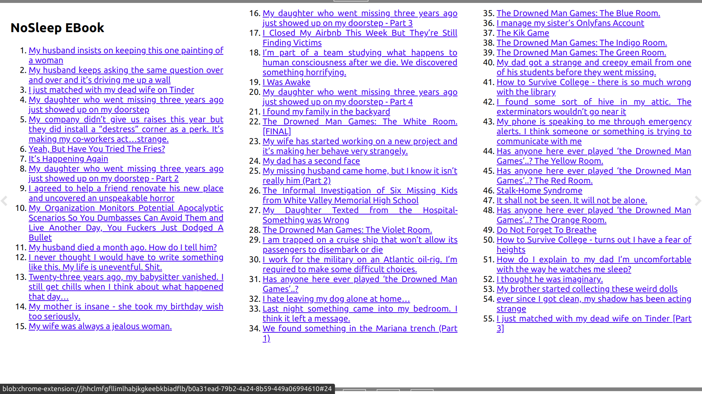
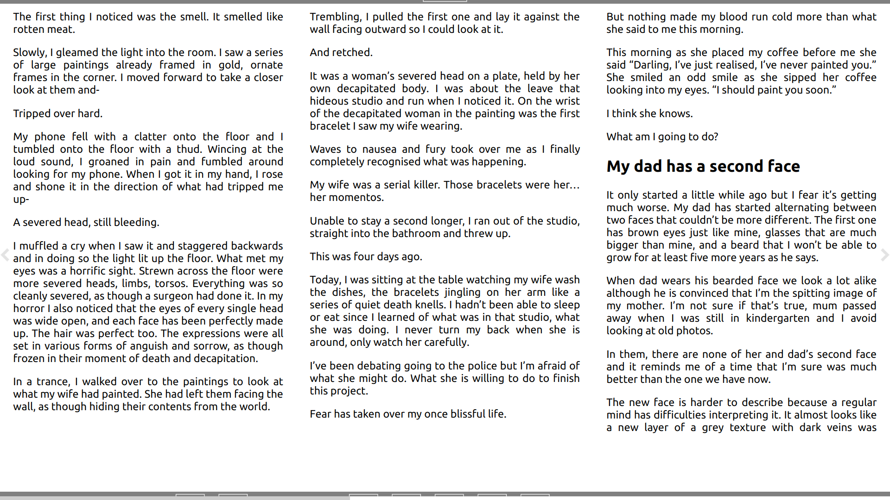

# nosleep-epub

A simple script to create an ebook from reddit posts.

## How?
- The script uses [PRAW](https://praw.readthedocs.io/en/stable/) to fetch posts from the configured subreddit.
- It then creates an epub file with the fetched posts as its content using [pandoc](https://pandoc.org/).
- Each post is modelled as a seperate chapter.
- A linked index is added at the beginning to jump across chapters.
- By default, it fetches top 100 posts from past month for the configured subreddit

Best suited for subreddits with text-based content where each post can be read offline as a seperate chapter/article. Some good subreddits that can be tried with this: r/nosleep, r/financialindependence, r/Ruleshorror

## Snaps from eBook:

